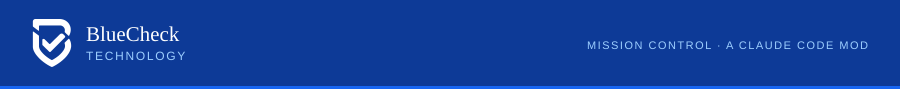
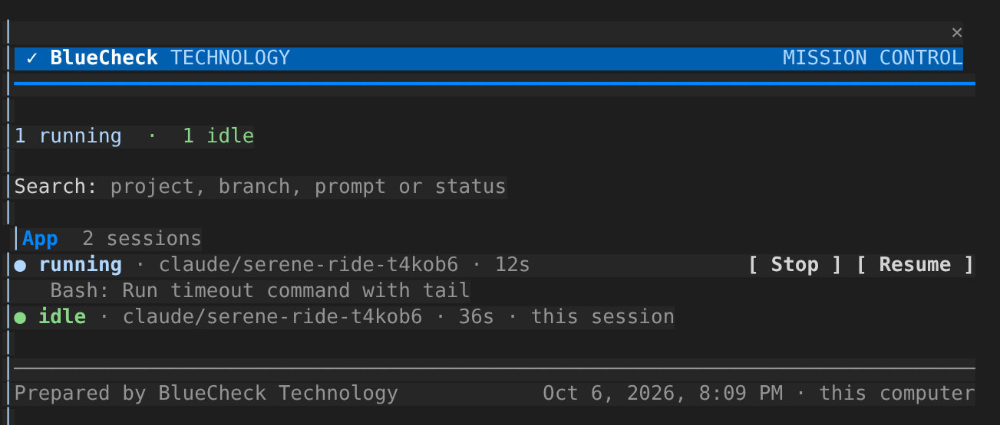
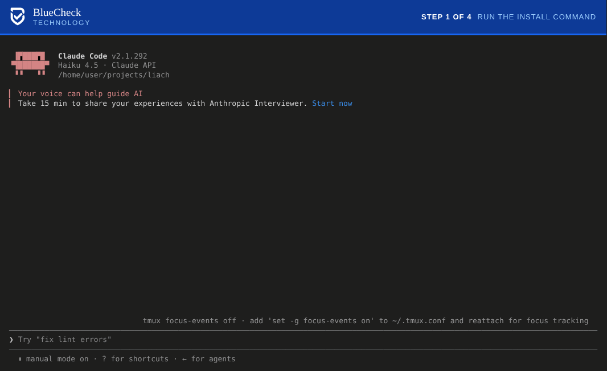
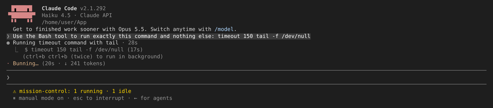
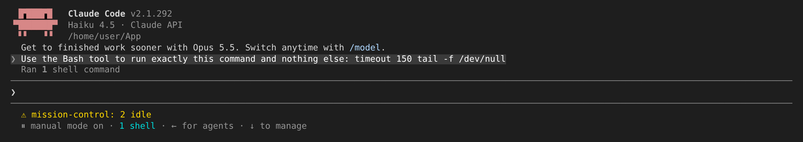

<p align="center"></p>

# Mission Control

A dashboard for every Claude Code session on your computer. It shows what each session is doing and which ones are waiting on you. Each running session gets a Stop button.



## Install



1. In Claude Code, run:
   ```
   /plugin install mission-control --marketplace LazarTaub/Claude-Dashboard-by-BlueCheck-Tech
   ```
2. Press `y` to add the marketplace.
3. Press Enter to install it for you.
4. Type `/mc`.

It works right away in that session. Sessions that are already open pick it up when you restart them.

Run the command in a terminal session: the desktop app's Code tab doesn't accept `/plugin`. Once installed, the dashboard loads in the desktop app too.

Project names and branches come from `git`. The PR column needs the GitHub CLI (`gh`), signed in.

## Use

- `/mc` opens the dashboard. `/mc breev` opens it with a search already typed.
- The search box filters by project, branch, prompt, PR number or status.
- Tab moves between buttons and Enter presses one.
- Stop ends that session's current turn.
- Resume copies the command that reopens that session in a terminal.
- Every session's status line shows the counts, for example `mission-control: 1 waiting · 2 running · 3 idle`.

Sessions are grouped by project. Worktrees of one repository share a group. Projects with a session waiting on you come first.

| Status | Meaning |
| --- | --- |
| running | A turn is in progress. The line under it shows the current tool. |
| waiting on you | A permission prompt or a question is open. |
| idle | Claude finished its turn. |
| lost | No heartbeat for 2 minutes, so the terminal closed or the process crashed. |
| done | The session ended. Done and lost sessions leave the board after 24 hours. |

## Pull requests

If the GitHub CLI (`gh`) is installed and signed in, each row shows its branch's pull request: the CI result, the latest `Confidence: N/5` from the Claude review comment, and the number of open review threads. It checks after every turn and every 2 minutes.

## How it works

Each session writes a small JSON file to `~/.claude/mission-control/sessions/` (under `CLAUDE_CONFIG_DIR` if you set it). It writes when a turn starts, when a tool runs, when a turn ends, and every 30 seconds. Each session reads the folder every 4 seconds. The file holds the project, branch, status, current tool and the first 140 characters of your last prompt. Nothing leaves your computer except the `gh` calls to GitHub.

Stop sends the other session a short message carrying a random token from that session's file. The other session's copy of Mission Control checks the token, removes the message before Claude reads it, and ends the turn. A message without the right token goes through untouched.

## Limits

- It covers one computer. Cloud sessions and other computers don't appear.
- Stop only reaches sessions that have Mission Control loaded. Sessions started before you installed it need a restart first.
- Stop ends the turn, but a shell command that was running keeps going in the background. The stopped session lists it as "1 shell", and you can end it there. Esc in that session kills the command instead.
- Resume copies a command. It can't bring another terminal window to the front.
- After you approve a permission prompt, a Bash command in a terminal switches back to "running" right away. Other tools stay at "waiting on you" until they finish.
- Tested on Linux with Claude Code 2.1.292. macOS and Windows should work but haven't been tested yet.

## Tested

Two live Claude Code sessions, A and B, in one terminal:

1. B ran a long command. A's dashboard listed it as running with a Stop button (the screenshot above).
2. A pressed Stop on B. B's turn ended, nothing appeared in B's conversation, and both status lines went to `2 idle`.
3. B hit a permission prompt and its row read "waiting on you". After approval it read "running" again.

| B before Stop | B after Stop |
| --- | --- |
|  |  |

`claude plugin test .` runs 19 tests: the status, grouping, search and PR parsing, plus the pane drawn on the terminal and the desktop app at full and narrow widths, the Stop message and its token check.

## Develop

```
git clone https://github.com/LazarTaub/Claude-Dashboard-by-BlueCheck-Tech
cd Claude-Dashboard-by-BlueCheck-Tech
claude plugin validate .
claude plugin test .
claude --plugin-dir .
```

The first time Claude Code loads the mod it writes its API types to `.claude-plugin/types/`. After that, `npx tsc -p .` type-checks the code.

`hooks/core.ts` holds the logic, `hooks/register.tsx` wires it to Claude Code events and draws the pane, and `hooks/brand.ts` holds the BlueCheck colors and mark.

## License

MIT. See [LICENSE](LICENSE).

<p></p>
